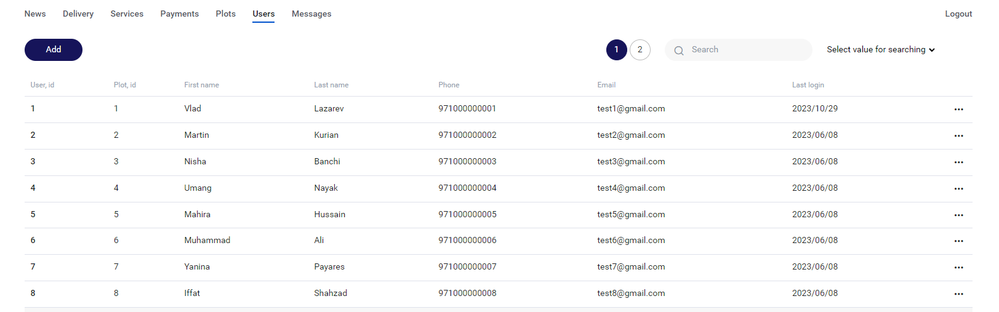
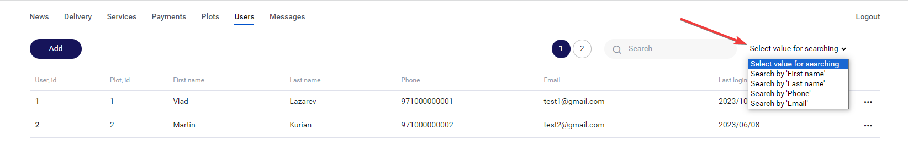
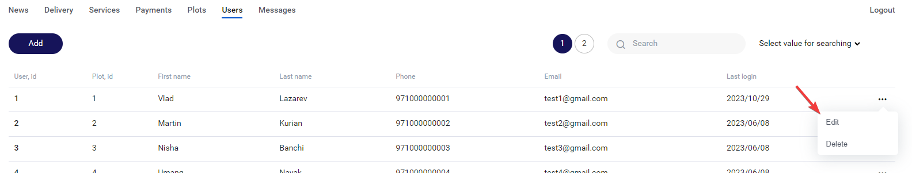
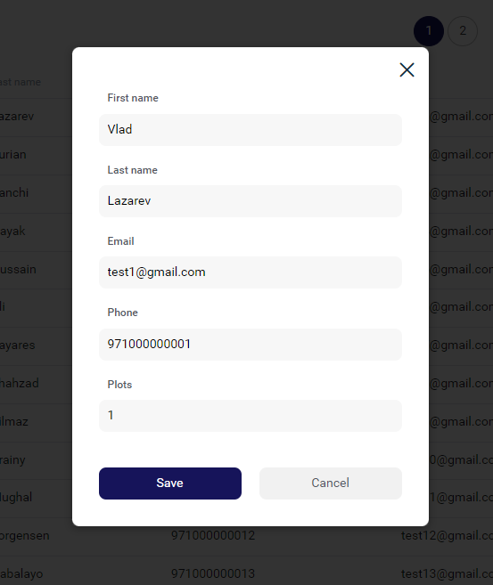
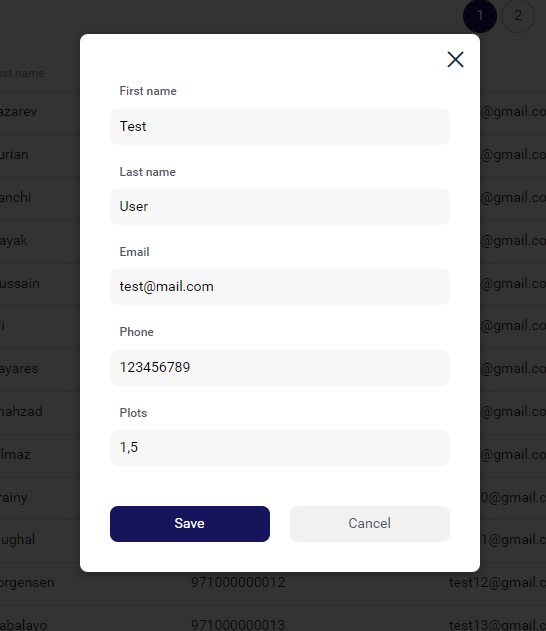
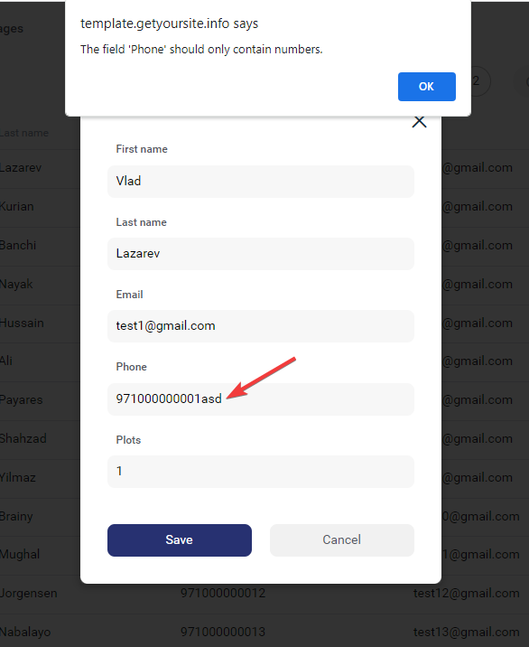
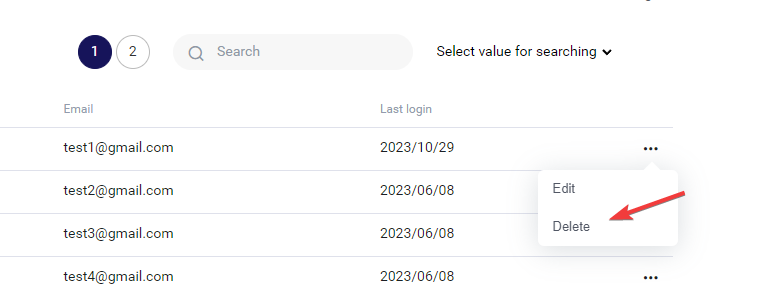
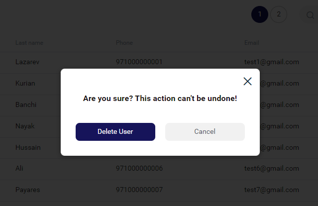

## AEON

Протестировать ТЗ online можно здесь:

```
https://template.getyoursite.info/
```

### Коротко, что сделано по ТЗ

1. Таблица Users с владельцами участков (колонки Plot ID, First name, Last Name, Phone, Email, Last login).
Пагинация по 20 записей на страницу (аналогично таблице Plots).
Страница реализуется в схожем дизайне, как страница с Plots.
В меню при выборе раздела Users он должен подсвечиваться аналогично выбору Plots.



2. Поиск по номеру телефона, имени и email пользователя.

Можно искать по 'first_name', 'last_name', 'email', 'phone'. Если не выбирать 
значение из выпадающего списка, то по умолчанию будет поиск по 'first_name'.



3. Редактирования пользователя (поля First name, Last name, Phone, Email, Plots)

Нажимем 'Edit'



и редактируем



4. Создать пользователя. Должна поддерживаться возможность добавить пользователя сразу к нескольким участкам (через запятую в поле Plots).

Нажать 'Add' и создать пользователя:



5. Если при редактировании какие-либо поля, кроме Plots не заполнены, не давать сохранить данные. При сохранении данных телефон фильтруется по не числовым символам, email переводится в lower case.
При создании пользователя это тоже работает.



6. Возможность удаления пользователя.

Чтобы удалить пользователя нужно нажать 'Delete':



и удалить или отменить удаление:

